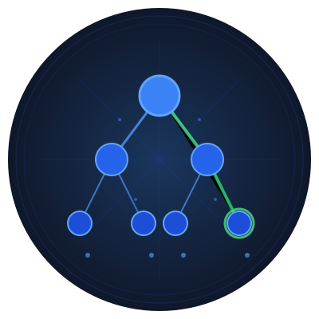

# Go Monte Carlo Tree Search (MCTS) Package

A flexible and efficient implementation of Monte Carlo Tree Search in Go, designed for sequence optimization problems with variable-length solutions.

{: style="width:100px; height:auto;" }

## Quick Start

```go
import "github.com/yourusername/mcts"

// Define your problem by implementing two functions:
// 1. NextElementsFunc - generates possible next elements
// 2. FitnessFunc - evaluates sequence fitness (smaller is better)

// Example: Find a sequence of numbers that sum to target
nextElements := func(seq []interface{}) []interface{} {
    if len(seq) >= 4 { // Max length constraint
        return nil
    }
    return []interface{}{1, 2, 3, 4, 5}
}

targetSum := 15
fitnessFunc := func(seq []interface{}) float64 {
    if len(seq) != 4 {
        return math.MaxFloat64
    }
    sum := 0
    for _, v := range seq {
        sum += v.(int)
    }
    return math.Pow(float64(sum-targetSum), 2)
}

// Configure and run MCTS
config := mcts.Config{
    ExplorationConstant: 2.0,
    MaxIterations: 2000,
    TargetSeqLength: 4,
    RandomSeed: time.Now().UnixNano(),
    DebugLevel: 1,
}

bestSequence, err := mcts.Run(
    []interface{}{},  // Initial sequence
    nextElements,
    fitnessFunc,
    config,
)
```

## Understanding MCTS

### What is Monte Carlo Tree Search?

Monte Carlo Tree Search (MCTS) is a decision-making algorithm that combines the precision of tree search with the power of random sampling. Imagine you're playing chess and trying to decide your next move. Instead of analyzing every possible future position (which would be overwhelming), MCTS does something clever:

1. It starts by making some random moves to see what might happen (like playing several quick games)
2. It keeps track of which initial moves led to better outcomes
3. It gradually focuses more attention on the promising moves while still occasionally trying others

The name "Monte Carlo" comes from the famous casino, because the algorithm uses randomness in a strategic way, similar to analyzing gambling outcomes.

### Why Use MCTS?

MCTS is particularly useful when:
- You need to make decisions in a large search space
- You can't evaluate all possibilities (like in Go or Chess)
- You want a balance between exploring new options and exploiting known good solutions
- You need an algorithm that can improve with more computation time

### Real-World Applications

- **Game AI**: Used in AlphaGo and many game-playing systems
- **Resource Optimization**: Finding efficient sequences of actions
- **Path Planning**: Discovering good routes in complex environments
- **Scheduling**: Optimizing task sequences
- **Chemical Synthesis**: Planning reaction sequences

## Mathematical Foundation

MCTS combines tree search with Monte Carlo sampling to efficiently explore large search spaces. The algorithm consists of four phases:

1. **Selection**: Starting from root, select child nodes using UCT (Upper Confidence Bound for Trees):
   ```
   UCT = exploitation - exploration
   where:
   exploitation = totalFitness / visits
   exploration = C * sqrt(ln(parentVisits) / visits)
   ```
   Note: This implementation uses minimization, hence the subtraction.

2. **Expansion**: Add a new child node by randomly selecting from available moves.

3. **Simulation**: Perform random playouts from the new node until reaching a terminal state.

4. **Backpropagation**: Update node statistics (visits and total fitness) back to root.

## Complete Example

Here's a working example of using MCTS to find a sequence of numbers that sum to a target value:

```go
package main

import (
    "fmt"
    "github.com/yourusername/mcts"
    "math"
    "time"
)

func main() {
    // Goal: Find sequence of 4 numbers that sum to 15
    targetSum := 15
    
    // Define available moves (numbers we can use)
    numbers := []int{1, 2, 3, 4, 5}
    
    // Function to generate next possible moves
    nextElements := func(seq []interface{}) []interface{} {
        if len(seq) >= 4 {  // Limit sequence to 4 numbers
            return nil
        }
        
        moves := make([]interface{}, len(numbers))
        for i, n := range numbers {
            moves[i] = n
        }
        return moves
    }
    
    // Function to evaluate how good a sequence is
    fitnessFunc := func(seq []interface{}) float64 {
        if len(seq) != 4 {
            return math.MaxFloat64
        }
        
        sum := 0
        for _, v := range seq {
            sum += v.(int)
        }
        
        // Return distance from target (smaller is better)
        return math.Abs(float64(sum - targetSum))
    }
    
    // Run MCTS
    config := mcts.Config{
        ExplorationConstant: 2.0,
        MaxIterations:      1000,
        TargetSeqLength:    4,
        RandomSeed:         time.Now().UnixNano(),
        DebugLevel:         1,
    }
    
    bestSequence, err := mcts.Run(
        []interface{}{},
        nextElements,
        fitnessFunc,
        config,
    )
    
    if err != nil {
        fmt.Printf("Error: %v\n", err)
        return
    }
    
    fmt.Printf("Found sequence: %v\n", bestSequence)
}
```

## Advanced Usage

### Variable-Length Sequences

The package naturally handles sequences of unknown length. Control sequence growth through the `NextElementsFunc`:

```go
// Example: Generate variable-length monotonic sequences
nextElements := func(seq []interface{}) []interface{} {
    if len(seq) >= maxLength {
        return nil
    }
    
    // For empty sequence, return all possible digits
    if len(seq) == 0 {
        return []interface{}{1, 2, 3, 4, 5}
    }
    
    // Get last element
    last := seq[len(seq)-1].(int)
    
    // Return only elements larger than last (strictly increasing)
    var valid []interface{}
    for _, n := range []int{1, 2, 3, 4, 5} {
        if n > last {
            valid = append(valid, n)
        }
    }
    return valid
}
```

### Game Playing Example

MCTS can be used for game playing. Here's a simplified Tic-Tac-Toe example:

```go
type GameState struct {
    board    [9]int
    nextMove int
}

nextElements := func(seq []interface{}) []interface{} {
    state := initialState.Copy()
    // Apply moves from sequence
    for _, move := range seq {
        state.MakeMove(move.(int))
    }
    
    if state.IsGameOver() {
        return nil
    }
    
    // Return available moves
    var moves []interface{}
    for i := 0; i < 9; i++ {
        if state.board[i] == 0 {
            moves = append(moves, i)
        }
    }
    return moves
}

fitnessFunc := func(seq []interface{}) float64 {
    state := initialState.Copy()
    for _, move := range seq {
        if !state.MakeMove(move.(int)) {
            return math.MaxFloat64
        }
    }
    
    if state.Winner() == myPlayer {
        return -1000 // Win
    } else if state.Winner() == 0 {
        return 0 // Draw
    }
    return 1000 // Loss
}
```

## Configuration Options

- `ExplorationConstant`: Controls exploration vs exploitation (default: 1.41)
- `MaxIterations`: Number of MCTS iterations to perform
- `TargetSeqLength`: Desired sequence length (can be adjusted dynamically)
- `RandomSeed`: Seed for reproducibility
- `DebugLevel`: Control debug output (0: none, 1: basic, 2: detailed)

## Thread Safety

The implementation is thread-safe and uses mutexes to protect shared state. The `Node` structure includes a mutex for concurrent access:

```go
type Node struct {
    sequence     []interface{}
    parent       *Node
    children     []*Node
    visits       int
    totalFitness float64
    mu           sync.Mutex
    unusedMoves  []interface{}
}
```

## Best Practices

1. **Fitness Function Design**
    - Return `math.MaxFloat64` for invalid sequences
    - Use negative fitness for better solutions (minimization)
    - Consider intermediate rewards for partial solutions

2. **NextElements Implementation**
    - Return `nil` for terminal states
    - Filter invalid moves early
    - Consider domain-specific constraints

3. **Performance Optimization**
    - Adjust `ExplorationConstant` based on problem characteristics
    - Use appropriate `MaxIterations` for your search space
    - Enable debug output initially to tune parameters

## License

MIT License

Copyright (c) 2024 [Your Name]

Permission is hereby granted, free of charge, to any person obtaining a copy
of this software and associated documentation files (the "Software"), to deal
in the Software without restriction, including without limitation the rights
to use, copy, modify, merge, publish, distribute, sublicense, and/or sell
copies of the Software, and to permit persons to whom the Software is
furnished to do so, subject to the following conditions:

The above copyright notice and this permission notice shall be included in all
copies or substantial portions of the Software.

THE SOFTWARE IS PROVIDED "AS IS", WITHOUT WARRANTY OF ANY KIND, EXPRESS OR
IMPLIED, INCLUDING BUT NOT LIMITED TO THE WARRANTIES OF MERCHANTABILITY,
FITNESS FOR A PARTICULAR PURPOSE AND NONINFRINGEMENT. IN NO EVENT SHALL THE
AUTHORS OR COPYRIGHT HOLDERS BE LIABLE FOR ANY CLAIM, DAMAGES OR OTHER
LIABILITY, WHETHER IN AN ACTION OF CONTRACT, TORT OR OTHERWISE, ARISING FROM,
OUT OF OR IN CONNECTION WITH THE SOFTWARE OR THE USE OR OTHER DEALINGS IN THE
SOFTWARE.